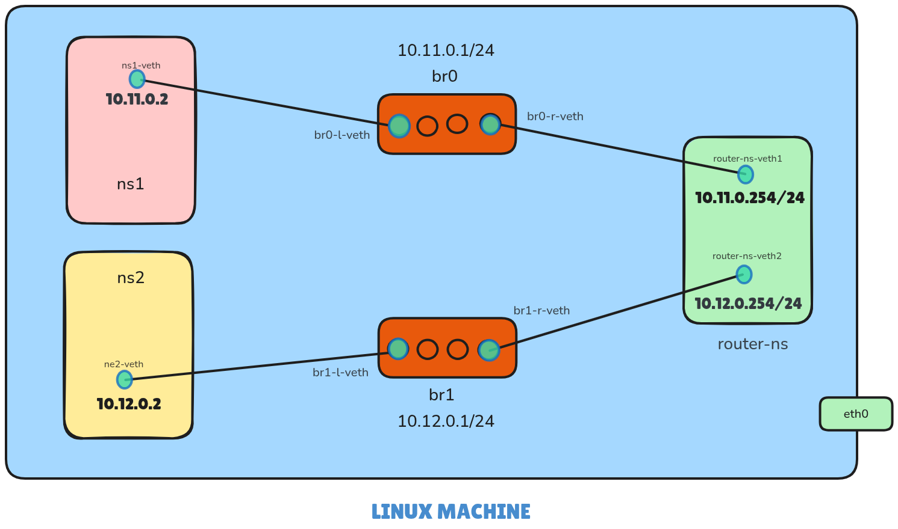

Here’s an updated version of your `README.md` file with the requested sections added: **IP Addressing Scheme**, **Routing Configuration**, and **Testing Procedures and Results**. These additions provide more clarity and detail about how the network is structured, how routing works, and how to test the setup.

---

# Network Namespace Configuration Script

This script sets up a virtual network environment using Linux **network namespaces**, **virtual Ethernet (veth) pairs**, and **bridges**. It creates two isolated namespaces (`ns1` and `ns2`) connected through a router namespace (`router-ns`). This setup is ideal for simulating network topologies, testing routing configurations, and learning about Linux networking.

## Table of Contents

1. [Prerequisites](#prerequisites)
2. [Script Overview](#script-overview)
3. [IP Addressing Scheme](#ip-addressing-scheme)
4. [Routing Configuration](#routing-configuration)
5. [Testing Procedures and Results](#testing-procedures-and-results)
6. [Visualization](#visualization)
7. [Usage](#usage)
8. [Cleanup](#cleanup)
9. [Troubleshooting](#troubleshooting)

---

## Prerequisites

Before running the script, ensure the following:

- A Linux system with the `iproute2` package installed.
- Root or `sudo` privileges.
- Basic knowledge of Linux networking concepts (e.g., namespaces, veth pairs, bridges).

You can install `iproute2` if it’s not already installed:

```bash
sudo apt-get install iproute2  # For Debian/Ubuntu
sudo yum install iproute       # For CentOS/RHEL
```

---

## Script Overview

The script automates the creation of a virtual network topology with the following components:

1. **Network Namespaces**

   - Three namespaces are created:
     - `ns1`: Simulates the first host.
     - `ns2`: Simulates the second host.
     - `router-ns`: Acts as the router connecting `ns1` and `ns2`.

2. **Bridges**

   - Two virtual bridges (`br0` and `br1`) are created to connect the namespaces to the router.

3. **Virtual Ethernet (veth) Pairs**

   - veth pairs are used to connect:
     - `ns1` to `br0`.
     - `ns2` to `br1`.
     - The router (`router-ns`) to both bridges.

4. **IP Address Assignment**

   - IP addresses are assigned to each interface for communication.

5. **Routing and IP Forwarding**

   - Default routes in `ns1` and `ns2` point to the router.
   - IP forwarding is enabled on the router namespace to allow traffic between `ns1` and `ns2`.

6. **Testing Connectivity**
   - The script tests connectivity from `ns1` and `ns2` to the router and between `ns1` and `ns2`.

---

## IP Addressing Scheme

The IP addressing scheme is as follows:

| **Namespace/Interface** | **IP Address** | **Subnet Mask** |
| ----------------------- | -------------- | --------------- |
| `ns1-veth` (in `ns1`)   | `10.11.0.2`    | `/24`           |
| `ns2-veth` (in `ns2`)   | `10.12.0.2`    | `/24`           |
| `router-ns-veth1`       | `10.11.0.254`  | `/24`           |
| `router-ns-veth2`       | `10.12.0.254`  | `/24`           |

- `ns1` resides in the `10.11.0.0/24` subnet.
- `ns2` resides in the `10.12.0.0/24` subnet.
- The router has interfaces in both subnets, acting as the gateway for each namespace.

---

## Routing Configuration

Routing is configured as follows:

1. **Default Routes in Namespaces**

   - In `ns1`, the default route points to the router's `10.11.0.254` interface:
     ```bash
     ip route add default via 10.11.0.254 dev ns1-veth
     ```
   - In `ns2`, the default route points to the router's `10.12.0.254` interface:
     ```bash
     ip route add default via 10.12.0.254 dev ns2-veth
     ```

2. **Routing Table in Router Namespace**

   - The router is configured to forward traffic between the two subnets:
     ```bash
     ip route add 10.11.0.0/24 dev router-ns-veth1
     ip route add 10.12.0.0/24 dev router-ns-veth2
     ```

3. **IP Forwarding**
   - IP forwarding is enabled on the router namespace to allow traffic between `ns1` and `ns2`:
     ```bash
     sysctl -w net.ipv4.ip_forward=1
     ```

---

## Testing Procedures and Results

### Testing Procedures

1. **Ping the Router**

   - Test connectivity from `ns1` to the router:
     ```bash
     sudo ip netns exec ns1 ping -c 3 10.11.0.254
     ```
   - Test connectivity from `ns2` to the router:
     ```bash
     sudo ip netns exec ns2 ping -c 3 10.12.0.254
     ```

2. **Ping Between Namespaces**
   - Test connectivity from `ns1` to `ns2` via the router:
     ```bash
     sudo ip netns exec ns1 ping -c 3 10.12.0.2
     ```
   - Test connectivity from `ns2` to `ns1` via the router:
     ```bash
     sudo ip netns exec ns2 ping -c 3 10.11.0.2
     ```

### Expected Results

- All pings should succeed, indicating that:
  - `ns1` and `ns2` can reach the router.
  - `ns1` and `ns2` can communicate with each other through the router.

If any test fails, refer to the [Troubleshooting](#troubleshooting) section.

---

## Visualization

The following image illustrates the network setup:



- `ns1` and `ns2` are isolated hosts connected to the router (`router-ns`) via bridges (`br0` and `br1`).
- The router acts as the gateway, enabling communication between the two hosts.

---

## Usage

1. Save the script as `setup_network.sh`:

   ```bash
   wget https://raw.githubusercontent.com/your-repo/setup_network.sh
   ```

2. Make the script executable:

   ```bash
   chmod +x setup_network.sh
   ```

3. Run the script with `sudo`:

   ```bash
   sudo ./setup_network.sh
   ```

4. After execution, verify connectivity:
   - Test `ns1` to `ns2`:
     ```bash
     sudo ip netns exec ns1 ping -c 3 10.12.0.2
     ```
   - Test `ns2` to `ns1`:
     ```bash
     sudo ip netns exec ns2 ping -c 3 10.11.0.2
     ```

---

## Cleanup

To remove all namespaces, bridges, and interfaces created by the script, run the following commands:

```bash
sudo ip netns del ns1
sudo ip netns del ns2
sudo ip netns del router-ns
sudo ip link del br0
sudo ip link del br1
```

Alternatively, you can create a cleanup script (`cleanup.sh`) for convenience:

```bash
#!/bin/bash
sudo ip netns del ns1
sudo ip netns del ns2
sudo ip netns del router-ns
sudo ip link del br0
sudo ip link del br1
```

Make it executable and run:

```bash
chmod +x cleanup.sh
sudo ./cleanup.sh
```

---

## Troubleshooting

If you encounter issues, follow these steps:

1. **Check IP Forwarding**

   - Ensure IP forwarding is enabled on both the host and the router namespace:
     ```bash
     sudo sysctl -w net.ipv4.ip_forward=1
     sudo ip netns exec router-ns sysctl -w net.ipv4.ip_forward=1
     ```

2. **Inspect Interfaces**

   - Use `ip link` and `ip addr` to check the status of interfaces:
     ```bash
     sudo ip netns exec ns1 ip link
     sudo ip netns exec ns1 ip addr
     ```

3. **Enter Namespaces for Debugging**

   - Access a namespace interactively for manual inspection:
     ```bash
     sudo ip netns exec ns1 bash
     ```

4. **Verify Routing Tables**

   - Check the routing tables in each namespace:
     ```bash
     sudo ip netns exec ns1 ip route
     sudo ip netns exec router-ns ip route
     ```

5. **Firewall Rules**
   - Ensure no firewall rules block traffic between namespaces:
     ```bash
     sudo iptables -L FORWARD
     ```
