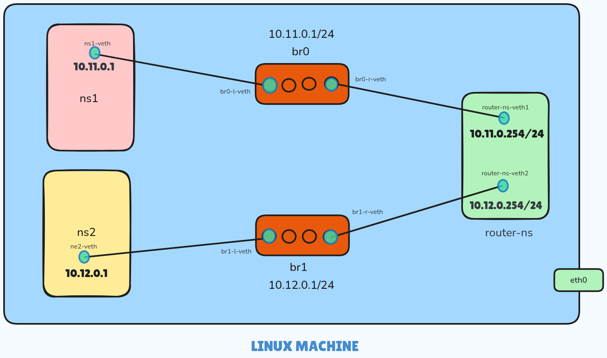

# Network Namespace Configuration Script

This script sets up a virtual network environment using Linux network namespaces, virtual Ethernet (veth) pairs, and bridges. It creates two namespaces (`ns1` and `ns2`) connected through a router namespace (`router-ns`).

## Prerequisites

- Linux system with `iproute2` package installed.
- Root or sudo privileges.

## Script Overview

1. **Create Network Namespaces**

   - `ns1`, `ns2`, and `router-ns` are created to simulate isolated network environments.

2. **Create and Configure Bridges**

   - `br0` and `br1` are created to connect the namespaces to the router.

3. **Add veth Pairs**

   - veth pairs (`br0-l-veth` <-> `ns1-veth`, `br1-l-veth` <-> `ns2-veth`) are used to connect `ns1` and `ns2` to their respective bridges.
   - Additional veth pairs (`br0-r-veth` <-> `router-ns-veth1`, `br1-r-veth` <-> `router-ns-veth2`) connect the router to the bridges.

4. **Assign IP Addresses and Bring Up Interfaces**

   - `ns1` is assigned `10.11.0.2/24`, `ns2` is assigned `10.12.0.2/24`, and the router interfaces are assigned `10.11.0.254/24` and `10.12.0.254/24`.

5. **Routing and IP Forwarding**

   - Default routes in `ns1` and `ns2` point to the router.
   - IP forwarding is enabled on the router.

6. **Testing Connectivity**
   - The script tests connectivity from `ns1` and `ns2` to the router and between `ns1` and `ns2`.

## Visualization

The following image illustrates the network setup:



## Usage

1. Save the script as `setup_network.sh`.
2. Make the script executable:
   ```bash
   chmod +x setup_network.sh
   ```
3. Run the script with sudo:
   ```bash
   sudo ./setup_network.sh
   ```

## Cleanup

To remove the namespaces and interfaces created by the script, run the following commands:

```bash
sudo ip netns del ns1
sudo ip netns del ns2
sudo ip netns del router-ns

sudo ip link del br0
sudo ip link del br1
```

## Troubleshooting

- Ensure IP forwarding is enabled on both the host and within the router namespace.
- Use `ip netns exec <namespace> bash` to enter a namespace for manual debugging.
- Check interface status using `ip link` and `ip addr` within the namespaces.

---

This setup is useful for simulating network topologies, testing routing configurations, and understanding network namespaces in Linux.
